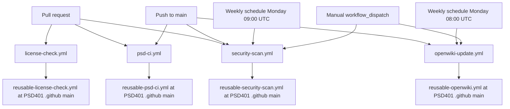

# CI workflow callers

All four workflows in `.github/workflows/` are thin callers. None of them defines build, test, license, or scan steps itself. Each job `uses:` a reusable workflow from the organization repository `PSD401/.github` on `@main`. Three pass `secrets: inherit`; the security scan does not (see the callers table). The behavior that actually runs in CI therefore lives outside this repository; this page documents only what the callers declare.

Caption: triggers for each caller workflow and the external reusable workflow each one delegates to.

## Callers

| Workflow | Triggers | Delegates to | Extra settings |
|---|---|---|---|
| `psd-ci.yml` (name `CI`, job `psd-ci`) | `pull_request`; `push` on `main` | `PSD401/.github/.github/workflows/reusable-psd-ci.yml@main` | `secrets: inherit` |
| `license-check.yml` (name `License`, job `license-check`) | `pull_request` only | `PSD401/.github/.github/workflows/reusable-license-check.yml@main` | `secrets: inherit` |
| `openwiki-update.yml` (name `OpenWiki Update`, job `openwiki`) | `workflow_dispatch`; `push` on `main`; cron `0 8 * * 1` | `PSD401/.github/.github/workflows/reusable-openwiki.yml@main` | `with: base_branch: main`; permissions and concurrency (below) |
| `security-scan.yml` (name `Security Scan`, job `security-scan`) | `pull_request`; `push` on `main`; cron `0 9 * * 1`; `workflow_dispatch` | `PSD401/.github/.github/workflows/reusable-security-scan.yml@main` | top-level and job `permissions: contents: read`; no `secrets` key, so no `secrets: inherit` |

## What the callers control

- **Triggers.** `psd-ci` runs on both pull requests and pushes to `main`. `license-check` runs only on pull requests. The OpenWiki job runs on push to `main`, weekly, and on demand. `security-scan` runs on pull requests, pushes to `main`, a weekly Monday 09:00 UTC cron (one hour after the OpenWiki cron), and on demand.
- **Permissions (security scan).** `contents: read` at both the workflow and job level. It requests no write scopes, unlike the OpenWiki caller.
- **Secrets (security scan).** The caller omits `secrets: inherit`, so no organization secrets are forwarded to the reusable scan. It can use only the token its job permissions grant. This is the only caller that does not forward secrets; whether the scan needs any is not visible here.
- **Permissions (OpenWiki only).** `contents: write` and `pull-requests: write`. The inline comment states the caller must grant these because the org default token is read-only.
- **Concurrency (OpenWiki only).** Group `openwiki` with `cancel-in-progress: true`. The workflow comment explains that several merges in a row would otherwise queue full regenerations, and only the last output survives.
- **Action pinning.** The reusable reference uses `@main` on purpose, so central changes propagate to every repository (the comment cites a drift-kill design). The `zizmor: ignore[unpinned-uses]` annotations mark this as an accepted exception to pinning.

## Boundaries and gaps

- The reusable workflows are not in this repository. Their steps, the checks they report, and the auto-merge behavior are not inspectable here. The OpenWiki caller's commit message says `auto_merge` uses the reusable default (`true`) so that docs pull requests limited to `openwiki/` merge themselves. Treat that as a commit-message claim, not verified code. The same applies to `reusable-security-scan.yml`, whose scanners and reporting are unverified here; the pinning comment in `security-scan.yml` cites `psd-dev-standards` standards/06 as the reason for `@main`.
- Nothing in this repository runs the callers' results locally. The only local checks are the package scripts described in [Build and test](build-and-test.md).
- `psd-ci` also runs on `push` to `main`, where a failure is not surfaced by a pull request check. Commit `a4bcab1` reports that CI on `main` had failed since `4abcead` without being noticed, because the canary gets few pushes and no failure alert covers push-triggered CI.

## Change guidance

- Changing a trigger or permission: edit only the caller file, and keep the job name stable if branch protection or required checks refer to it. Verify with a pull request run in GitHub Actions; there is no local runner.
- Changing the reusable pin (for example `@main` to a tag): this crosses into the org's propagation policy. Escalate rather than changing it in a single repository.
- Changing `security-scan.yml` permissions or adding `secrets: inherit`: the scan currently runs read-only and without forwarded secrets. Widening either is a policy change to confirm against the reusable workflow before merging.
- Validation before pushing: `git diff --check -- .github/workflows` is the narrowest local check available for whitespace; semantic validation happens only when Actions runs.

## Related

- [OpenWiki maintenance](../operations/openwiki-maintenance.md) for what the OpenWiki job does after it starts.
- [Dependency updates](../operations/dependency-updates.md) for how Dependabot keeps the `uses:` action versions current.
- [Architecture overview](../architecture/overview.md) for how these callers fit the enforcement-testing purpose.
