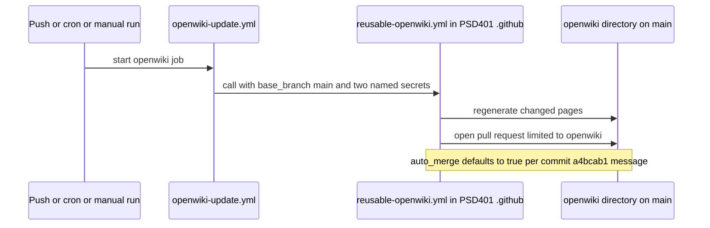

# OpenWiki maintenance

This repository has a generated knowledge base in `openwiki/` at the repository root. The `openwiki/` tree is regenerated by the **OpenWiki Update** workflow (`.github/workflows/openwiki-update.yml`), which delegates the actual generation to the org reusable `reusable-openwiki.yml`. Treat the wiki as derived output: change the source, then let the workflow regenerate the docs.

## Why the wiki is committed here

The repository's own commit history gives the reason. Commit `a4bcab1` ("Add the org OpenWiki caller") says OpenWiki is required on every PSD401 repository, and that this canary needs a committed wiki so the org's OpenWiki smoke test can exercise the **update-an-existing-wiki** path. The same message reports that one tool version failed only on that update path.

## Triggers and settings

- Triggers: `push` to `main`, a weekly cron (`0 8 * * 1`, Monday 08:00 UTC) as a backstop, and `workflow_dispatch` for manual runs.
- Concurrency: group `openwiki` with `cancel-in-progress: true`. Overlapping runs are cancelled so only the latest regeneration completes.
- Permissions: `contents: write` and `pull-requests: write`, set by the caller because the org default token is read-only.
- Base branch: `base_branch: main`.
- Secrets: only `BEDROCK_API_KEY` (model) and `PSD_AUTOMATION_APP_PRIVATE_KEY` (the App that opens and merges the docs pull request) are passed by name. The caller does not use `secrets: inherit`; see [CI workflows](../delivery/ci-workflows.md#callers) for the canonical secrets policy and its commit-message rationale.

## Run flow

Caption: the OpenWiki job delegates generation and the pull request to the reusable workflow. The steps inside the reusable workflow are not in this repository; the auto-merge note comes from the commit message, not from inspected code.

## Incremental updates

Each successful run records its commit in `openwiki/.last-update.json` (`gitHead`). The next update diffs from that commit to decide which pages need changes, so an update should preserve accurate pages and touch only the sections affected by source changes. Without a recorded `gitHead`, the next run has no baseline and must rebuild from the current tree.

## Rules for editing

- Do not hand-edit generated pages unless a change is explicitly requested. The root `AGENTS.md` (present as an untracked file in the checkout) says the same: prefer updating source or docs and letting OpenWiki regenerate.
- Source of truth for this repository is small: `package.json`, `test/`, `.github/`, `README.md`, and `LICENSE`. Pages in this wiki summarize those files; see [Architecture overview](../architecture/overview.md).
- Keep page front matter valid, and use relative links to other wiki pages.

## Validation

- Local: `git status --short openwiki` shows which generated files changed. There is no local generator command in this repository.
- Remote: the `OpenWiki Update` workflow run and its pull request are the authoritative check. Failures there are in the reusable workflow or the generator, not in the package scripts.

## Scope boundaries

- The generator, its model choice, and its smoke test live in the org `PSD401/.github` repository. Changes there propagate here through the `@main` pin described in [CI workflows](../delivery/ci-workflows.md).
- Application or test changes do not require a wiki regeneration to be correct; the wiki is documentation, not a build input.

## Related

- [CI workflows](../delivery/ci-workflows.md) for the trigger and pinning model this workflow shares with the other callers.
- [Build and test](../delivery/build-and-test.md) for the source the wiki describes.
